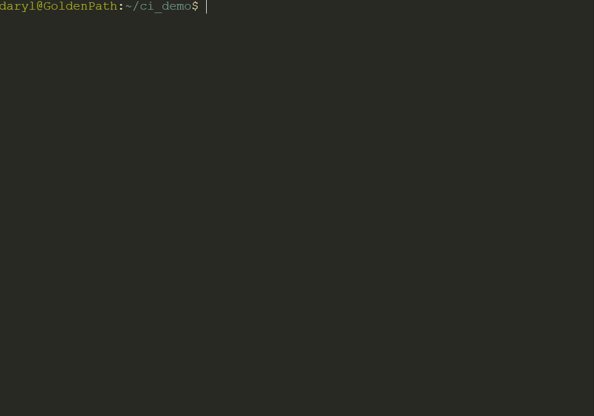

# `ci` - Interactive `cd`

[](https://codecov.io/gh/goldenpathtechnologies/ci)

`ci` is an interactive version of the familiar `cd` command. Easily traverse directories in the terminal without having to cycle between `cd` and `ls`.

## Demo


## Installation

Download and extract the [latest release](https://github.com/GoldenPathTechnologies/ci/releases/latest) package for your operating system and run the installation script from the extracted location.

**Linux (Bash)**
```bash
# Install
./install.sh

# Uninstall
./uninstall.sh
```

**Windows (PowerShell)**
```powershell
# Install
.\install.ps1

# Uninstall
.\uninstall.ps1
```

Alternatively, you can build from source from either the release's source archive or from a git clone.

```bash
# TODO: Create a build command or makefile for others to build the project themselves.
```

## Usage

```
# Open a terminal GUI to traverse directories
ci

# Get help
ci -h
ci --help

# Check version information
ci -v
ci --version
```

### Basic controls
- Left and right arrows navigate to parent and child directories respectively
- Up and down arrows select different child directories or menu items
- `Enter` navigates to the selected directory and exits
- `q` quits without navigating
- Press `h` to view additional keymappings and information

## Support
If you discover an issue while using or contributing to `ci`, please open an issue. For all other inquiries or comments, please use the following in order of increasingly general requests/concerns:
- [GitHub Discussion Page](https://github.com/goldenpathtechnologies/ci/discussions)
- [Email](mailto:daryl@goldenpath.ca)

## Roadmap
See the [open issues](https://github.com/goldenpathtechnologies/ci/issues) and give a thumbs up for those you would like to see resolved first. How much positive attention an issue has plays a role in how soon it gets released. Showstopping defects/bugs always have top priority. 

## Contributing
There are several ways you can contribute to `ci`. You can do so by:

- Creating new issues if you find any defects, or if there is a feature you would like to see developed.
- Forking the project and creating pull requests. Please see the [contributing guide (TBD)](https://github.com/GoldenPathTechnologies/ci/TBD) for more information.
- Donating to help fund project maintenance, the creation of additional solutions like `ci`, and to support an independent developer. (TBD)
- Spreading the word. The more people know about `ci`, the better!
- Dowloading, installing, and giving `ci` a GitHub star if you really like it.

## Acknowledgements
Special thanks goes to these resources and tools, without which `ci` would not have been made possible.
- [JetBrains GoLand](https://www.jetbrains.com/go/)
- [`tview`](https://github.com/rivo/tview)
- [Tcell](https://github.com/gdamore/tcell)
- [go-flags](https://github.com/jessevdk/go-flags)
- [semantic-release](https://github.com/semantic-release/semantic-release)
- [commitizen](https://github.com/commitizen-tools/commitizen)
- ... and all the resources credited throughout the source code

Feel free to [reach out](https://github.com/goldenpathtechnologies) if you discover a resource that hasn't been properly acknowledged here.

## License

`ci` is [MIT](https://github.com/goldenpathtechnologies/ci/blob/main/LICENSE) licensed.